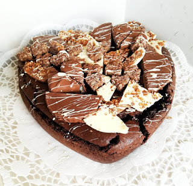
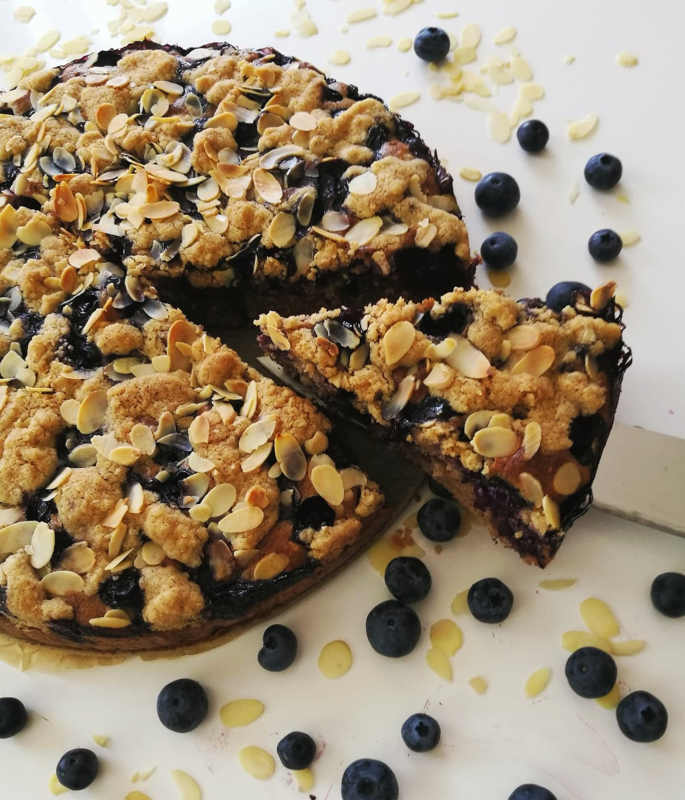

<!DOCTYPE html>
<html lang="en">
<head>
<body style="background-color:thistle">
<title>Baking</title>
<meta charset="utf-8">
<meta name="viewport" content="width=device-width, initial-scale=1">

</head>
<body>

<header>
  <h2>Baking</h2>
</header>

<section>
  <nav>
  
<u> Recipes</u>

    <ul>
      <li><a href= bc.html>Brownie cake</a></li>
      <li><a href= bbc.html>Blueberry crumble cake</a></li>
    </ul>
  </nav>
  
  <article>
    <h1 style="color:brown">Brownie cake</h1>
    
Every now and then we just need to let loose and allow ourselves to enjoy a "chocolate with chocolate dessert". After all, what is a better way to release those endorphins than eating a delicious brownie cake?!

    

<u>Ingredients</u>

    <ul>
      <li>250g chocolate</li>
<li>250g butter</li>
<li>6 eggs</li>
<li>650g sugar</li>
<li>230g flour</li>
<li>60g cocoa</li>
<li>2 teaspoons vanilla extract</li>
<li>2 teaspoons cinnamon</li>
<li>1/2 teaspoon nutmeg</li>
<li>pinch of salt</li>
<li>(optional) 2 tablespoons of rum/amaretto</li>
<li>(optional) almonds</li>
    </ul>
 
<u>Instructions</u>

 
First thing first, preheat your oven to 180C, the preparation of this cake is very simple and quick so turn that oven on. Then cut the butter and chocolate into smaller pieces and melt in a bowl over hot water. While the chocolate is melting, mix all of your dry ingredients. After the chocolate is melted transfer it into your mixing bowl and add one egg at a time and then mix in vanilla extract and dry ingredients. If you want to incorporate some additional stuff like nuts or fruit, now is the time. When everything is ready, pour the dough into a cake pan with baking paper and bake for about 45 minutes (the time is just approximate, every oven bakes differently so keep an eye on that). Let the cake cool completely and decorate to your own taste. And lastly, enjoy! :)

The key ingredient in this cake is high quality and tasty chocolate! If you don´t know what kind to use, click on the picture to view a website that ranks chocolates! 

  </article>

</section>
  <article>
    <h1 style="color:brown">Blueberry crumble cake</h1>
    
This cake is the best comfort cake in my opinion. It requires only cupboard/freezer ingredients and the process is really easy, making it the ideal cake for lazy day when you´re craving something comforting.

     

<u>Ingredients</u>

    <ul>
 <li>1 1/2 cups all-purpose flour</li>
 <li>2 tsp baking powder</li>
 <li>1 tsp cinnamon</li>
 <li>3/4 cup sugar</li>
 <li>1/2 tsp cardamom</li>
 <li>1/2 cup melted butter</li> 
 <li>2 tsp vanilla extract</li>
 <li>2/3 cup milk</li>
 <li>2 eggs</li>
 <li>pinch of salt</li>
 <li>blueberries </li>
 <li>almonds</li>
 <li>homemade crumble (recipe from <a href= https://www.goodtoknow.co.uk/recipes/crumble-topping>here</a>)</li>
    </ul>
 
<u>Instructions</u>

 
The instructions for this cake are really easy. First, preheat your oven to 180 degrees celsius. Secondly mix all your dry ingredients in a big bowl, then add wet ingredients to the bowl and lastly almonds. Mix it all together and transfer into a pan. Top with blueberries (fresh or frozen) and crumble. Bake for 50-55 minutes. For the ultimate comfort cake drizzle the cake with <a href= https://www.lecremedelacrumb.com/best-cinnamon-roll-icing/>icing</a>. And the most important step - bon appetit! :)

 </article>

</body>
